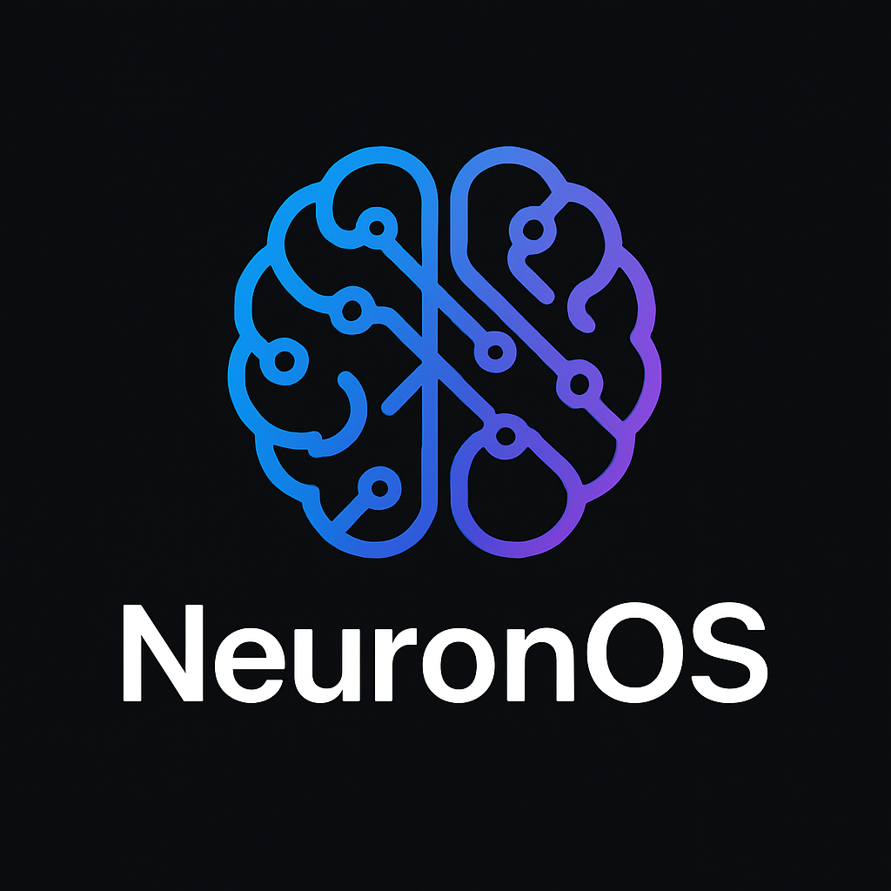

# NeuronOS

<p align="center">
  
</p>

<p align="center">
  <strong>A specialized Linux distribution for Data Science and AI</strong>
</p>

<p align="center">
  <a href="#features">Features</a> •
  <a href="#installation">Installation</a> •
  <a href="#included-tools">Included Tools</a> •
  <a href="#customization">Customization</a> •
  <a href="#development">Development</a> •
  <a href="#contributing">Contributing</a> •
  <a href="#license">License</a>
</p>

## Overview

NeuronOS is a specialized Linux distribution designed for data scientists, AI researchers, and machine learning engineers. It comes pre-configured with the most popular tools and libraries for data science and AI development, providing a seamless and efficient environment for innovation.

### Key Principles

- **Fast & Efficient**: Optimized for performance with a lightweight desktop environment
- **Modern & Beautiful**: Clean, modern interface with a dark theme optimized for long coding sessions
- **Pre-configured**: All the tools you need for data science and AI, ready to use out of the box
- **Easy to Use**: Intuitive interface and comprehensive documentation
- **Extensible**: Simple package management and customization options

## Features

- **Optimized Performance**: Tuned kernel parameters, efficient memory management, and SSD optimizations
- **Modern UI**: Sleek, glass-effect interface with a dark theme and modern fonts
- **Pre-installed Tools**: Comprehensive suite of data science and AI tools
- **Development Environment**: VS Code with extensions, Git integration, and Docker support
- **Data Science Stack**: Python, R, Jupyter, and more
- **AI Frameworks**: TensorFlow, PyTorch, Hugging Face Transformers, and more
- **Example Applications**: Ready-to-run examples for Streamlit, Gradio, and more

## Project Status

🚧 **Early Development** 🚧

This project is currently in the development phase. We're building the core components and refining the user experience.

## Installation

### System Requirements

- **CPU**: 64-bit processor (x86_64), 2+ cores recommended
- **RAM**: 4 GB minimum, 8 GB or more recommended for AI workloads
- **Disk Space**: 20 GB minimum, 50 GB or more recommended
- **GPU**: NVIDIA GPU recommended for AI workloads (but not required)
- **Display**: 1024x768 or higher resolution

### Installation Methods

#### Method 1: Installing from ISO

1. **Download the ISO**:
   - Download the latest NeuronOS ISO from the releases page

2. **Create a Bootable USB Drive**:
   - On Windows: Use [Rufus](https://rufus.ie/) or [Etcher](https://www.balena.io/etcher/)
   - On Linux: Use the `dd` command or Etcher
   - On macOS: Use Etcher

3. **Boot from the USB Drive**:
   - Restart your computer and boot from the USB drive
   - You may need to change the boot order in your BIOS/UEFI settings

4. **Install NeuronOS**:
   - Follow the on-screen instructions to install NeuronOS
   - You can choose to install alongside your existing OS or replace it

#### Method 2: Using a Virtual Machine

1. **Download the VM Image**:
   - Download the NeuronOS VM image from the releases page

2. **Import the VM**:
   - Open VirtualBox or VMware
   - Import the downloaded OVA file
   - Start the VM

### Building from Source

To build NeuronOS from source, see the [Development](#development) section below.

## Project Structure

```
neuronos/
├── build/               # Scripts for building ISO
├── config/              # Config files (e.g. hostname, themes)
├── packages/            # Custom packages and preinstalled apps
│   ├── ai/              # AI tools (PyTorch, TensorFlow, etc.)
│   ├── ds/              # Data science libs (Pandas, Jupyter, etc.)
│   ├── system/          # Core apps like terminal, editor
├── ui/                  # UI design files (Qt/KDE config, themes)
├── docs/                # Installation and dev docs
├── tools/               # Installers, utilities
├── scripts/             # Shell/Python automation scripts
├── LICENSE
└── README.md
```

## Contributing

Contributions are welcome! Please feel free to submit a Pull Request.

## License

This project is licensed under the MIT License - see the LICENSE file for details.

## Acknowledgments

- Based on Ubuntu/Debian
- Inspired by the needs of the AI and Data Science community
